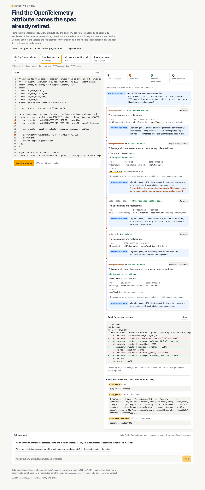
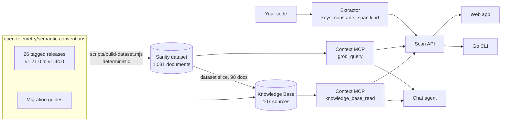

# Semconv Sentinel

**Find the OpenTelemetry attribute names the spec already retired.**

Paste instrumentation code. Semconv Sentinel finds every attribute key and SDK constant in it, checks each one against all 940 attributes of the OpenTelemetry semantic conventions, and tells you what to use instead, for your span kind, with the release that deprecated it and the exact spec line that says so. It then writes a patch for the renames that are safe to automate and leaves the rest for a person.

| | |
| --- | --- |
| Live app | https://semconv-sentinel.vercel.app (no login) |
| Project page | https://vignesh2027.github.io/semconv-sentinel |
| Sanity project ID | `y9raau23`, dataset `production` (public) |
| Public dataset query | [deprecated attributes as JSON](https://y9raau23.apicdn.sanity.io/v2025-02-19/data/query/production?query=*%5B_type%3D%3D%22attribute%22%26%26status%3D%3D%22deprecated%22%5D%7Bkey%2Cdeprecation%7D) |
| Sanity Studio | https://semconv-sentinel.sanity.studio |
| Context MCP (dataset) | `https://api.sanity.io/v2026-03-03/context/mcp/y9raau23/production/semconv-sentinel` |
| Context MCP (Knowledge Base) | `https://api.sanity.io/v1/context/organizations/oc2g3x7ee/mcp/semconv-sentinel-kb` |



## Why this needs structured content

The semantic conventions rename attributes between releases. `http.method` became `http.request.method`, `db.system` became `db.system.name`, and 58 `gen_ai.*` attributes moved to a separate repository in v1.44.0. Old blog posts, SDK constants and copied snippets keep the retired names alive.

A text search over the docs cannot answer these correctly:

* **`net.peer.name` has two answers.** It is `server.address` on client spans and `client.address` on server spans. The agent reads the span kind from your code and picks one. If the code does not state a span kind, it asks.
* **Some keys are split, merged or conditional.** `db.sql.table` becomes `db.collection.name` only if the value is not extracted from `db.query.text`. `code.function` is folded into a fully qualified `code.function.name`.
* **Some are not renames at all.** `event.name` moves to the log record's EventName field. 23 attributes were removed with no replacement.
* **The registry and the migration guide can disagree.** The registry says `db.name` was renamed to `db.namespace`. The database migration guide says it was removed and integrated into `db.namespace`. The app surfaces both and keeps that key out of the patch.

Each of those facts is a field in a Sanity document, not a sentence in a page.

## How it works



1. **Import.** `scripts/fetch-semconv.mjs` downloads every tagged release since v1.21.0. `scripts/build-dataset.mjs` builds one `attribute` document per key from the newest release, and uses the older releases to record `introducedIn` and `deprecatedIn`. It reads both YAML formats, including the `definition/2` format that v1.44.0 introduced for stable attributes.
2. **Verdicts in code, not in a model.** Each deprecated attribute gets a verdict computed from the spec's own `reason`, `renamed_to` and `note` fields. Replacements are stored with the condition they apply under (`always`, `client spans`, `server spans`, `together`).
3. **Scan.** The extractor finds string keys, SDK constants (Go `semconv.DBSystemKey`, JS `SEMATTRS_HTTP_METHOD` and `ATTR_*`, Java and Python `*Attributes.DB_SYSTEM`), enum constants like `semconv.DBSystemRedis`, the span kind in effect, and any pinned semconv version. It sends one GROQ query through the Context MCP `groq_query` tool, then reads the matching migration guide entries through `knowledge_base_read`.
4. **Answer.** Every finding shows the verdict, the replacement for its span kind, when it was deprecated, whether your pinned version already had it deprecated, the migration guide row, and a link to the spec YAML line. The trace panel shows every Context call and its GROQ.

## Verdicts

| Verdict | Count | Meaning |
| --- | ---: | --- |
| `RENAMED` | 97 | One new key, always |
| `REPLACED` | 16 | One new key; the spec does not call it a rename |
| `SPAN_KIND_DEPENDENT` | 2 | Different key on client and server spans |
| `SPLIT` | 3 | Several keys, set together |
| `CONDITIONAL` | 1 | The note states a condition |
| `MERGED_INTO` | 4 | Fold the value into another key |
| `USE_SIGNAL_FIELD` | 2 | Use a field of the span or log record |
| `MOVED_OUT` | 58 | Maintained in another repository now |
| `REMOVED` | 23 | Delete it |

No attribute is left as `NEEDS_REVIEW`. The counts come from `data/summary.json`.

## Real repositories

The Go CLI scanned five open-source repositories at pinned commits. Full results with a link to every line are in [bench/RESULTS.md](bench/RESULTS.md).

| Repository | Deprecated usages in code | Files to touch |
| --- | ---: | ---: |
| open-telemetry/opentelemetry-demo | 6 | 4 |
| jaegertracing/jaeger | 67 | 13 |
| redis/go-redis | 9 | 4 |
| go-gorm/opentelemetry | 0 | 0 |
| uptrace/opentelemetry-go-extra | 18 | 7 |

A finding means the key is deprecated in the spec. Test fixtures that read old data, or libraries that dual-emit on purpose during a migration, may keep the old key for now.

## Sanity content model

| Type | Holds |
| --- | --- |
| `attribute` | `key`, `status`, `stability`, `type`, `brief`, `note`, `examples`, enum `members`, `introducedIn`, `deprecation`, `source` |
| `deprecation` (object) | `verdict`, `reason`, `note`, `deprecatedIn`, `replacements[]`, `movedTo` |
| `replacement` (object) | `key`, `when`, weak reference to the replacement `attribute` |
| `sourceRef` (object) | `release`, `file`, `line`, `url` to the exact YAML line |
| `namespace` | `name`, `attributeCount` |
| `specRelease` | `tag` and per-release attribute and deprecation counts |
| `sanity.agentContext` | The Agent Context document: slug, GROQ filter and instructions for the MCP endpoint |

## Repository layout

| Path | What it is |
| --- | --- |
| `scripts/` | Fetch the spec releases and build `data/semconv.ndjson` |
| `studio/` | Sanity Studio, schema, structure, Agent Context document |
| `kb/` | Knowledge Base sources and the script that rebuilds it |
| `web/` | Next.js app: scan API, chat agent, UI |
| `cli/` | Go CLI for local trees and CI |
| `bench/` | Real repository scan and results |
| `docs/` | GitHub Pages site and screenshots |

## Use the CLI

```sh
cd cli && go build -o sentinel .
./sentinel ~/code/my-service              # report
./sentinel -fail ~/code/my-service        # exit 1 on any deprecated usage (CI)
./sentinel -fix ~/code/my-service         # apply only the unambiguous string renames
./sentinel -json ~/code/my-service        # machine-readable
```

## Run it yourself

```sh
npm install && npm run fetch && npm run build-data   # data/semconv.ndjson
cd studio && npm install && npx sanity login
npx sanity dataset import ../data/semconv.ndjson production --replace
npx sanity schema deploy && node agent-context.mjs
cd ../web && npm install && npm run dev
```

`web/.env.local` needs `SANITY_API_READ_TOKEN` (project viewer). The Knowledge Base enrichment also needs `SANITY_KB_MCP_URL`, `SANITY_KB_ID` and `SANITY_ORGANIZATION_TOKEN` (organization, Context Viewer). The chat agent needs `GROQ_API_KEY`. Scanning works without it.

## Tests

```sh
cd web && npm test          # extractor and patch tests
cd cli && go vet ./...
```

## Credits

Attribute data and the files in `kb/sources/` come from [open-telemetry/semantic-conventions](https://github.com/open-telemetry/semantic-conventions) and [open-telemetry/opentelemetry-specification](https://github.com/open-telemetry/opentelemetry-specification), Apache License 2.0. The Go sample is `redishook.go` from my [Bug Smash entry](https://github.com/vignesh2027/bugsmash-sentry-demo).

Built by [vignesh2027](https://github.com/vignesh2027) for the DEV Sanity Challenge. MIT License.
