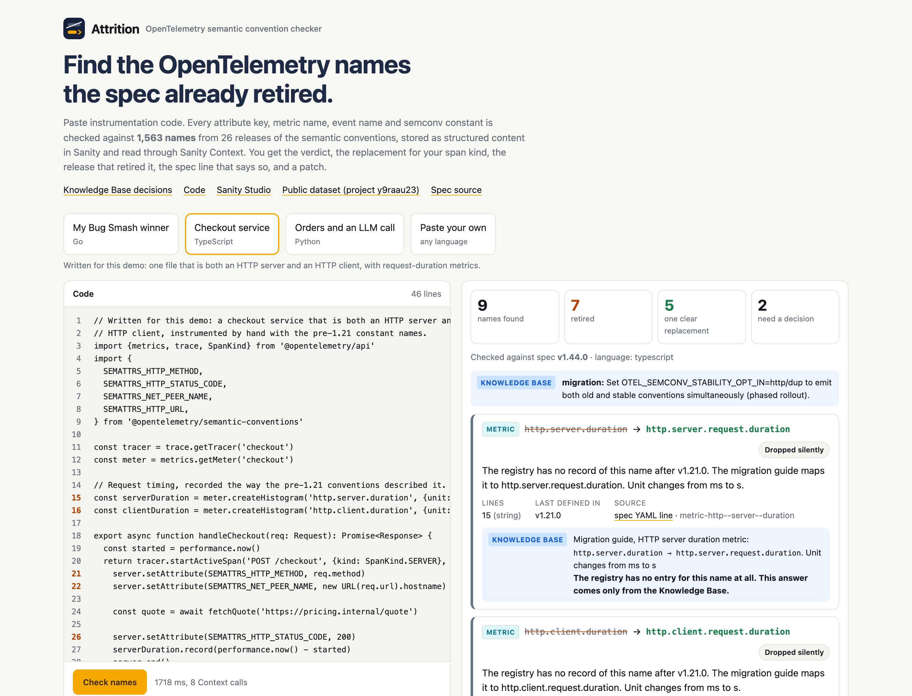
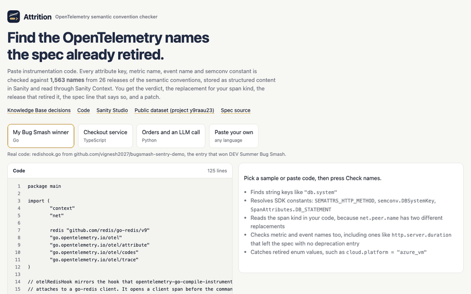
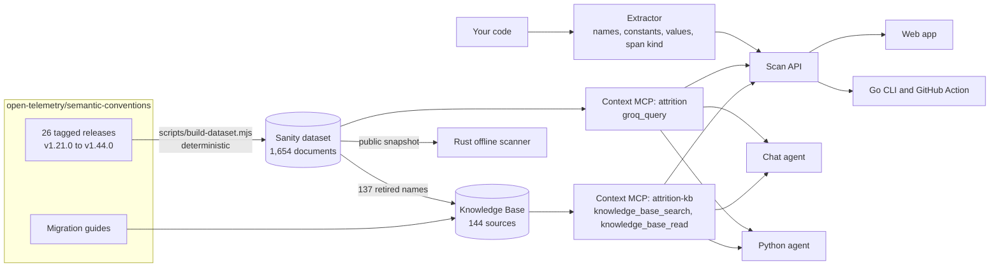
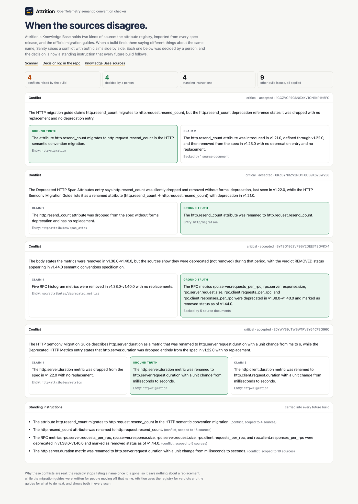
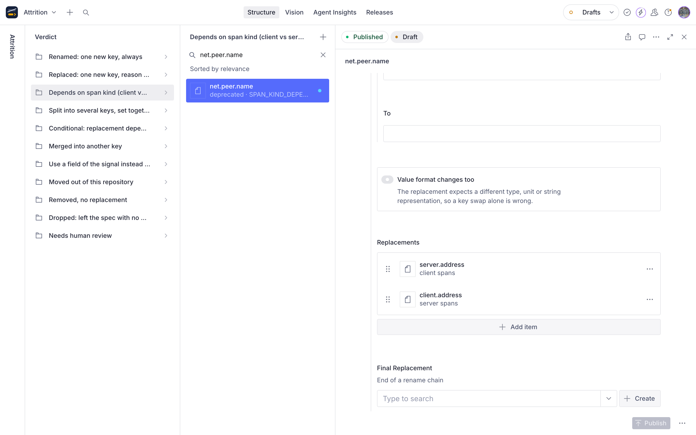
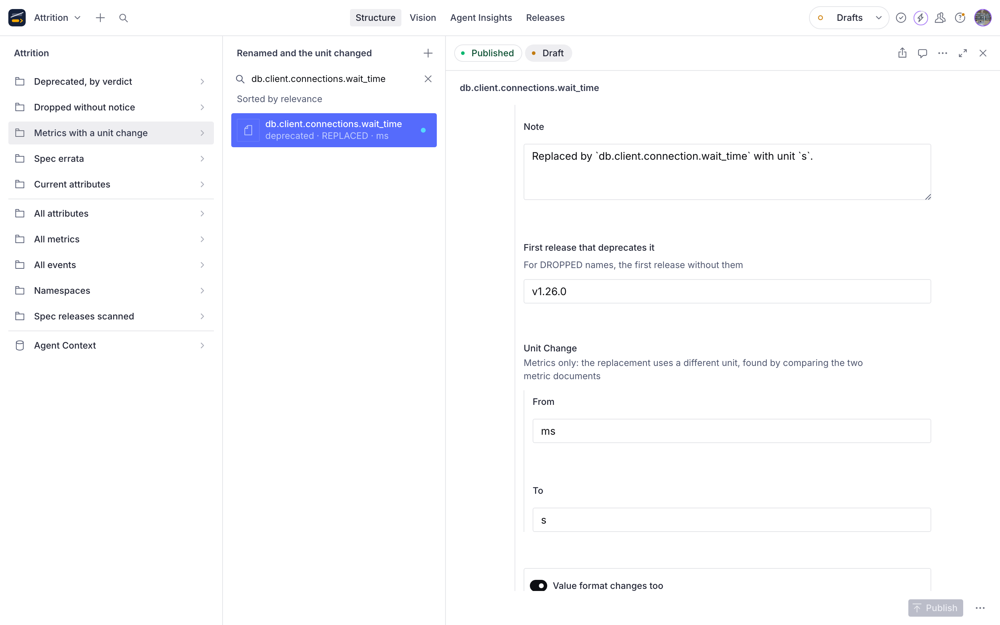
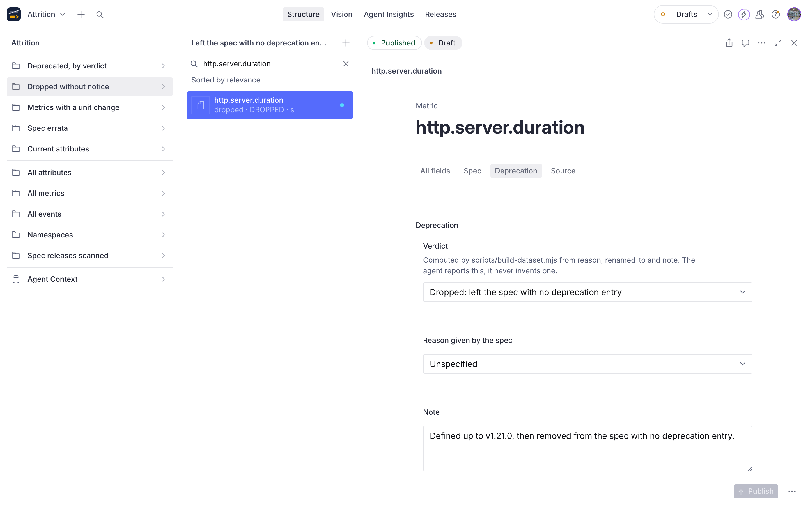
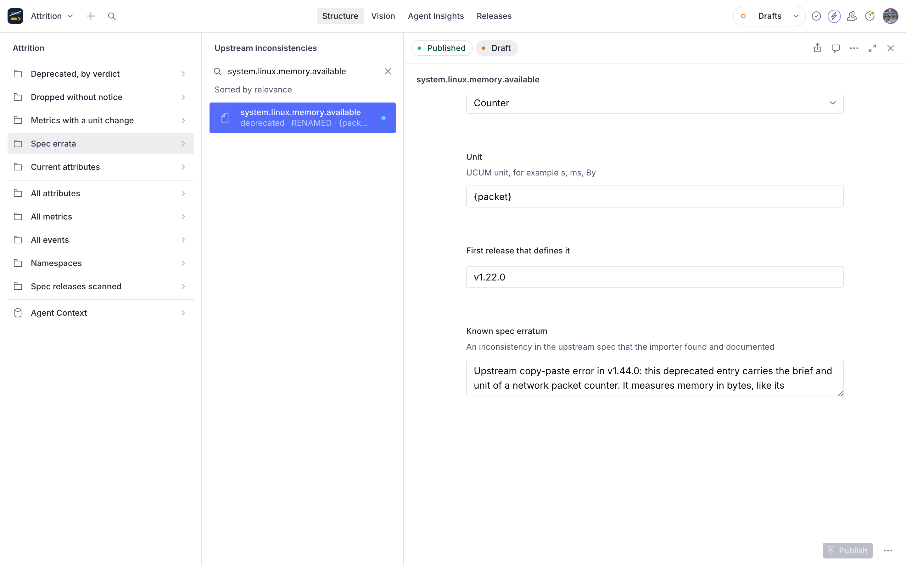

# Attrition

**Find the OpenTelemetry names the spec already retired.**

Paste instrumentation code. Attrition finds every attribute key, metric name, event name, enum value and SDK constant in it, checks each one against 1,563 names from 26 releases of the OpenTelemetry semantic conventions, and tells you what to use instead: for your span kind, with the release that retired it, the exact spec line that says so, and what the official migration guide adds. It writes a patch only for the renames that are safe to automate and leaves the rest for a person.

| | |
| --- | --- |
| Live app | https://attrition-otel.vercel.app (no login) |
| Knowledge Base decisions | https://attrition-otel.vercel.app/decisions |
| Project page | https://vignesh2027.github.io/attrition |
| Sanity project ID | `y9raau23`, dataset `production` (public) |
| Public dataset query | [every retired name as JSON](https://y9raau23.apicdn.sanity.io/v2025-02-19/data/query/production?query=*%5B_type%20in%20%5B%22attribute%22%2C%22metric%22%2C%22event%22%5D%20%26%26%20status%20!%3D%20%22current%22%5D%7B_type%2Ckey%2Cstatus%2Cdeprecation%7D) |
| Sanity Studio | https://attrition.sanity.studio |
| Context MCP, dataset | `https://api.sanity.io/v1/context/organizations/oc2g3x7ee/mcp/attrition` |
| Context MCP, Knowledge Base | `https://api.sanity.io/v1/context/organizations/oc2g3x7ee/mcp/attrition-kb` |





## Why this needs structured content

The semantic conventions rename things between releases, and old blog posts, SDK constants and copied snippets keep the retired names alive. A text search over the docs cannot answer these correctly:

* **One name, two answers.** `net.peer.name` is `server.address` on client spans and `client.address` on server spans. Attrition reads the span kind from your code. If the code does not state one, it asks.
* **Names that vanished with no record.** `http.server.duration` was in v1.21.0 and is simply gone from the registry, with no deprecation entry. 50 names left this way. Only the migration guide records the replacement, `http.server.request.duration`, and that the unit changed from ms to s.
* **A rename that changes the data.** `db.client.connections.wait_time` became `db.client.connection.wait_time`, and the unit went from ms to s. Renaming the key alone would record wrong values. Attrition compares the two metric documents and holds it out of the patch.
* **Values, not just keys.** `cloud.platform = "azure_vm"` is a current key with a retired value; it is now `"azure.vm"`.
* **Sources that disagree.** The registry says `db.name` was renamed to `db.namespace`; the database guide says it was removed and integrated. Attrition shows both and keeps that key for a person.

Each of those facts is a field in a Sanity document, not a sentence in a page.

## How it works



1. **Import.** `scripts/fetch-semconv.mjs` downloads every tagged release since v1.21.0. `scripts/build-dataset.mjs` builds one document per attribute, metric and event from the newest release, and reads every older release for `introducedIn`, `deprecatedIn`, and names that disappeared with no deprecation entry (`DROPPED`, with `lastSeenIn`). It handles both YAML formats, including the `definition/2` format of v1.44.0.
2. **Verdicts in code, not in a model.** Each retired name gets a verdict computed from the spec's own `reason`, `renamed_to` and `note` fields. Replacements carry the condition they apply under (`always`, `client spans`, `server spans`, `consumer spans`, `together`). A renamed metric whose replacement has a different unit gets `unitChange`, found by comparing the two documents.
3. **Scan.** The extractor finds string keys, metric and event names (read by the call they sit in, since a few names are both), deprecated enum values next to their key, SDK constants in Go, TypeScript, Java and Python, the span kind in effect, and any pinned semconv version. One `groq_query` reads every verdict. Then `knowledge_base_search` finds the right migration guide entry for each retired name and `knowledge_base_read` reads it. No entry path is hard-coded, because Knowledge Base builds rename entries.
4. **Answer.** Each finding shows the verdict, the replacement, the release, the unit change, the guide row and a link to the spec YAML line. The trace panel lists every Context call and its GROQ.

## Verdicts

Across 940 attributes, 571 metrics and 36 events:

| Verdict | Attributes | Metrics | Events | Meaning |
| --- | ---: | ---: | ---: | --- |
| `RENAMED` | 97 | 71 | 1 | One new name, always |
| `REPLACED` | 15 | 5 | 5 | One new name; the spec does not call it a rename |
| `SPAN_KIND_DEPENDENT` | 3 | | | Different key per span kind |
| `SPLIT` | 4 | | | Several keys, set together |
| `CONDITIONAL` | 2 | | | The note states a condition |
| `MERGED_INTO` | 4 | | | Fold the value into another key |
| `USE_SIGNAL_FIELD` | 2 | | | Use a field of the span or log record |
| `MOVED_OUT` | 58 | 11 | 3 | Maintained in another repository now |
| `REMOVED` | 21 | 10 | 1 | Delete it |
| `DROPPED` | 16 | 30 | 4 | Left the spec with no deprecation entry |

24 enum values are deprecated on their own, for example `cloud.platform = "azure_vm"`. No name is left as `NEEDS_REVIEW`. The importer also found a copy-paste erratum in the upstream spec: two deprecated `system.linux.memory.*` entries carry the brief and unit of a network packet counter. It is recorded as `specErratum` instead of being reported as a unit change.

## The Knowledge Base, and the decisions it raised

Knowledge Base `kbI5ncVyqDpc` was built entirely from the Sanity CLI from 144 sources, inside the 150 document beta budget: 137 retired attributes and metrics bound from the dataset, five official migration guides, and two older spec pages that still use the retired names.

Its build raised four real conflicts. The dataset says `http.server.duration` and `http.resend_count` left the registry with no replacement; the guides say they were renamed. Both are true at different levels, and the guide is the ground truth for what to use. Each conflict was resolved by a person, which turned it into a standing instruction for every later build, and the entries were rewritten to match. [See them side by side](https://attrition-otel.vercel.app/decisions), or read [kb/DECISIONS.md](kb/DECISIONS.md).



## Real repositories

The Go CLI scanned five open-source repositories at pinned commits, and the Rust offline scanner matched every count. Full results with a link to every line: [bench/RESULTS.md](bench/RESULTS.md).

| Repository | Retired names in code | Files to touch |
| --- | ---: | ---: |
| open-telemetry/opentelemetry-demo | 6 | 4 |
| jaegertracing/jaeger | 67 | 13 |
| redis/go-redis | 16 | 4 |
| go-gorm/opentelemetry | 0 | 0 |
| uptrace/opentelemetry-go-extra | 18 | 7 |

go-redis's `redisotel` package registers the old `db.client.connections.*` pool metrics and records `create_time` and `use_time` in milliseconds, so a plain rename to the new names would report values a thousand times too large. A finding means the name is retired in the spec; test fixtures that read old data, or libraries that dual-emit on purpose, may keep it for now.

## Four ways to run it

| | Language | Needs network | Best for |
| --- | --- | --- | --- |
| [Web app](https://attrition-otel.vercel.app) | TypeScript, Next.js | yes | Pasting a file, reading the evidence, asking the agent |
| [`cli/`](cli) | Go | yes, live Sanity Context | Whole repositories and CI, `-fix` for safe renames |
| [`rust/`](rust) | Rust | once, for the snapshot | Pre-commit hooks and air-gapped CI |
| [`python/`](python) | Python | yes | A terminal agent on the same MCP endpoints |

### GitHub Action

```yaml
- uses: actions/checkout@v4
- uses: vignesh2027/attrition@main
  with:
    path: services/
    fail: "true"
```

It writes the report to the job summary and fails the job when code uses a retired name.

### CLI

```sh
cd cli && go build -o attrition .
./attrition ~/code/my-service           # report
./attrition -fail ~/code/my-service     # exit 1 on any retired name in code (CI)
./attrition -fix ~/code/my-service      # apply only the unambiguous string renames
./attrition -json ~/code/my-service     # machine-readable
```

## Sanity content model

| Type | Holds |
| --- | --- |
| `attribute` | `key`, `status` (current, deprecated, dropped), `stability`, `type`, `brief`, `note`, `examples`, enum `members` with `deprecated` and `replacementValue`, `introducedIn`, `lastSeenIn`, `deprecation`, `source` |
| `metric` | `key`, `instrument`, `unit`, `status`, `stability`, `introducedIn`, `lastSeenIn`, `specErratum`, `deprecation`, `source` |
| `event` | `key`, `status`, `stability`, `introducedIn`, `lastSeenIn`, `deprecation`, `source` |
| `deprecation` (object) | `verdict`, `reason`, `note`, `deprecatedIn`, `replacements[]`, `valueChanges`, `unitChange`, `movedTo` |
| `replacement` (object) | `key`, `when`, weak references to the replacement attribute or metric |
| `sourceRef` (object) | `release`, `file`, `line`, `url` to the exact YAML line |
| `namespace`, `specRelease` | Namespace counts, and per-release attribute, metric and event counts |

The Studio groups retired names by verdict and adds views for silently dropped names, metrics with a unit change, and spec errata.

| | |
| --- | --- |
|  |  |
|  |  |

## Repository layout

| Path | What it is |
| --- | --- |
| `scripts/` | Fetch the spec releases and build `data/semconv.ndjson` |
| `studio/` | Sanity Studio, schema, structure, and `mcp-endpoints.mjs` for both Context MCP endpoints |
| `kb/` | Knowledge Base sources, rebuild script and decision log |
| `web/` | Next.js: scan API, chat agent, Decisions page, UI |
| `cli/` | Go CLI, also used by the GitHub Action |
| `rust/` | Rust offline scanner |
| `python/` | Python terminal agent |
| `bench/` | Real repository scan, results and Rust parity check |
| `docs/` | GitHub Pages site and screenshots |
| `tools/shots/` | Scripts that take the screenshots and the demo GIF |

## Run it yourself

```sh
npm install && npm run fetch && npm run build-data   # data/semconv.ndjson
cd studio && npm install && npx sanity login
npx sanity dataset import ../data/semconv.ndjson production --replace
npx sanity schema deploy && node mcp-endpoints.mjs
cd ../web && npm install && npm run dev
```

`web/.env.local` needs `SANITY_ORGANIZATION_TOKEN` (organization token with Context Viewer), `SANITY_KB_MCP_URL` and `SANITY_KB_ID` for the Knowledge Base, and `GROQ_API_KEY` for the chat agent. Scanning works without the chat key.

## Tests

```sh
cd web && npm test           # extractor and patch tests
cd rust && cargo test        # Rust extractor tests
cd cli && go vet ./...
WORK=/tmp/attrition-bench bench/run.sh && WORK=/tmp/attrition-bench bench/parity.sh
```

CI runs the web, Go and Rust checks and runs the Action on the repository's own samples.

## Credits

Spec data and the files in `kb/sources/` come from [open-telemetry/semantic-conventions](https://github.com/open-telemetry/semantic-conventions) and [open-telemetry/opentelemetry-specification](https://github.com/open-telemetry/opentelemetry-specification), Apache License 2.0. The Go sample is `redishook.go` from my [Bug Smash entry](https://github.com/vignesh2027/bugsmash-sentry-demo).

Built by [vignesh2027](https://github.com/vignesh2027) for the DEV Sanity Challenge. MIT License.
